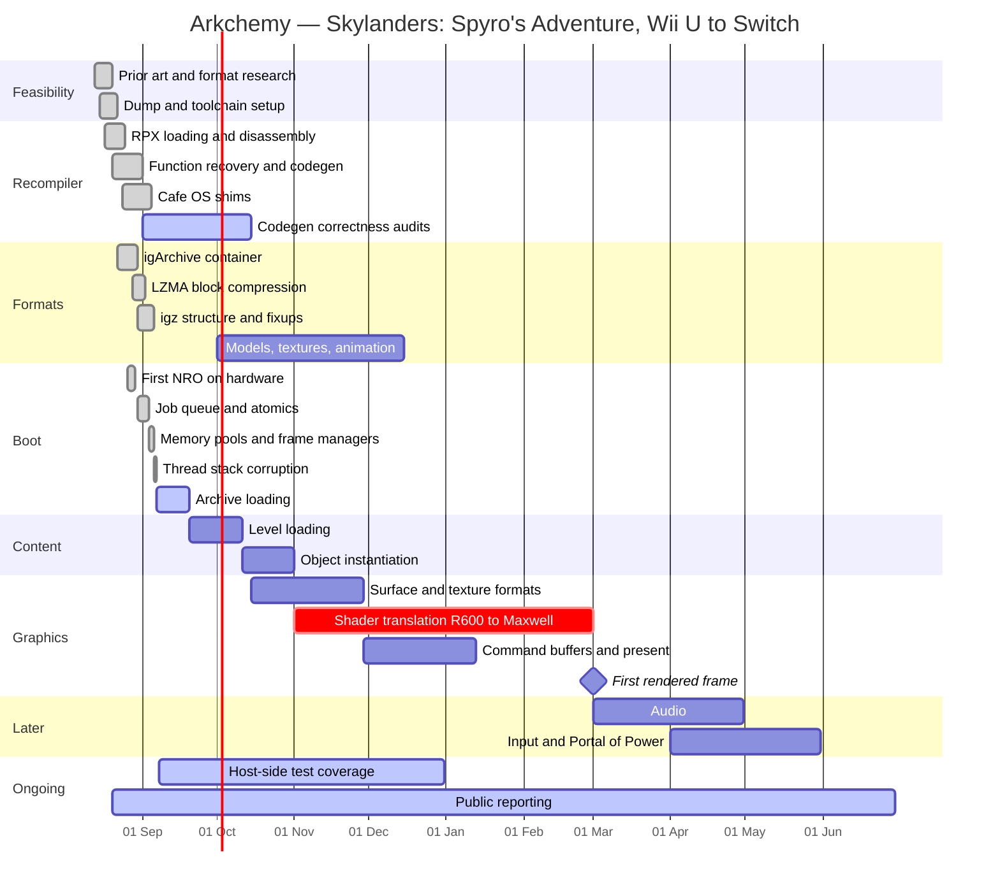

# Project schedule

A Gantt chart of Arkchemy, past and planned. Dates before 2026-09-08 are what
actually happened, taken from the project log and commit history; everything
after is planned and deliberately coarse — a reverse-engineering project cannot
honestly schedule a task whose difficulty is not yet known.

Durations for the graphics phase are the least certain figures in this
document. They are ranges of intent, not commitments.

## Critical path

**Shader translation is the critical path**, and it is the only task marked
critical above. Everything in the Graphics section gates the first rendered
frame, and nothing in Audio, Input or the Online work can begin meaningfully
before that.

Three tasks can run genuinely in parallel because they touch different
subsystems: codegen audits, format research, and host-side test coverage. That
is why they are scheduled as overlapping rather than sequential.

## Dependencies worth stating

- Level loading depends on archive loading, which currently depends on a config
  merge that does not happen
- Model and texture format work feeds the graphics phase and should therefore
  *precede* it, which is why it starts in October rather than after
- Audio and input are genuinely independent of graphics and could be pulled
  forward if graphics stalls — worth remembering if the shader work proves as
  hard as expected

## Milestones

| Milestone | Criterion | Status |
| --- | --- | --- |
| M1 Translation complete | 100% of `.text` translated | Met 2026-09-01 |
| M2 Runs on hardware | `.nro` boots and executes guest code | Met 2026-08-29 |
| M3 Engine initialises | static init completes, threads run | Met 2026-09-07 |
| M4 Render loop | GX2 pipeline driven each frame | Met 2026-09-08 |
| M5 Archive loads fully | all 35 blocks, level opens | In progress |
| M6 First rendered frame | anything visible on screen | Planned |
| M7 Playable level | movement, collision, camera | Not scheduled |

## Honesty note

The graphics dates are the weakest part of this chart. GX2 shaders are
compiled AMD R600 machine code and deko3d expects offline-compiled Nvidia
Maxwell binaries; there is no established route between them. 120 days is a
guess informed by the fact that the shader set is finite and ships on the disc,
which makes pattern-matching a plausible fallback to full translation. If that
assumption is wrong the estimate is wrong by a lot, and the chart should be
revised rather than defended.
